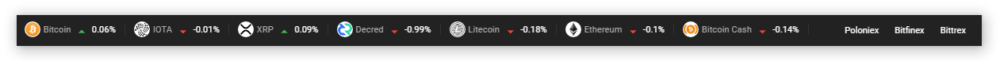
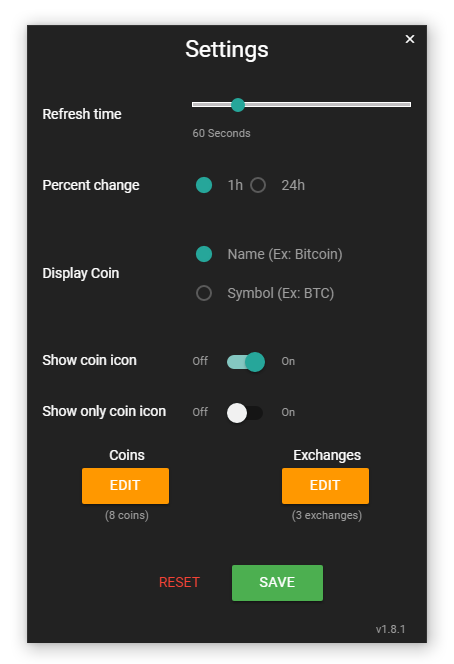

## CryptoBar is a way to check variations on your cryptocurrencies and tokens on a discreet bar.


## Getting Started

To get started you can:

Download [here](https://github.com/adlerluiz/CryptoBar/releases) the latest release

or

Clone this repository locally:

``` bash
git clone https://github.com/adlerluiz/CryptoBar.git
```

Install dependencies with npm:

``` bash
npm install
```

And finally:

```
npm start  
```

## To contribute

See [Angular-Electron](https://github.com/maximegris/angular-electron) to learn more commands and enjoy =D.

## Contributors
[adlerluiz](https://github.com/adlerluiz)
<br />
[rickinbsb](https://github.com/rickinbsb)


